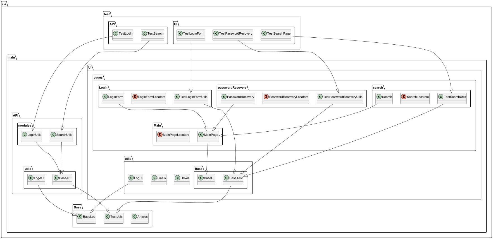
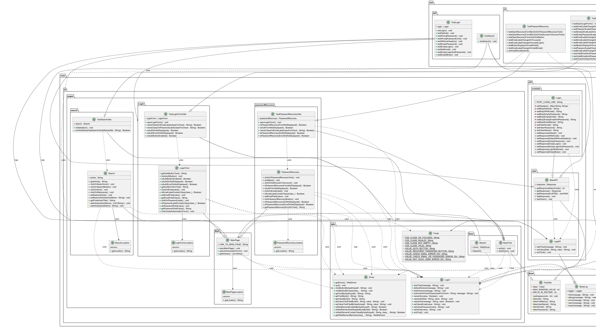

# Тестируемый автоматизированный фреймворк
## "РИА Новости"

> **Автоматизированный проект тестирования онлайн-сервиса "РИА Новости"**, включающий как UI-, так и API-тесты, реализованные на Java с использованием современных инструментов и библиотек.

## Описание

Тестовый фреймворк покрывает два уровня:
- **UI-тестирование** (через браузер, с проверкой состояния элементов, валидации, поведения форм);
- **API-тестирование** (валидация ответов сервера при различных сценариях авторизации).

## Что покрывают тесты

### ✅ UI

Тестируются компоненты формы логина и восстановления пароля:
- Активность кнопок при загрузке;
- Валидация полей email и пароля;
- Появление/исчезновение ошибок;
- Поведение при вводе невалидных значений;
- Сохранение данных после закрытия формы.

### ✅ API

Проверяются различные сценарии обращения к endpoint авторизации:
- Пустые/невалидные email и пароль;
- Невалидный формат email;
- Отсутствие headers;
- Проверка лимитов по неудачным попыткам входа;
- Статус-коды и тело ответа.

# RIA Authorization & Password Recovery Tests


## Среда разработки


- **IntelliJ IDEA** — основная IDE для разработки и запуска тестов.

---

## Используемые инструменты

| Инструмент                                                                                                                                                                                                                         | Назначение                               |
|------------------------------------------------------------------------------------------------------------------------------------------------------------------------------------------------------------------------------------|-------------------------------------------|
|   **Maven** | Сборка проекта и управление зависимостями |
|  **Postman**                                          | Визуальное тестирование API-запросов      |
|  **Jenkins**                                                                                                                                                         | Автоматизация CI/CD                       |
|  **GitHub**                                                                                                                                                | Хранение и версионирование кода          |
|  **PlantUML**                                                                                                                                                                           | Диаграммы и документация                 |

---

## Технологии тестирования

| Библиотека            | Назначение                                          |
|------------------------|-----------------------------------------------------|
|  **JUnit 5**       | Фреймворк для написания и запуска тестов |
|  **REST Assured** | Тестирование REST API                     |
|  **Selenium WebDriver** | Автоматизация UI-тестов                   |
|  **Java Faker**      | Генерация случайных данных                          |
|  **Log4j**           | Логгирование тестов                                |


# Диаграмма классов (мини-версия)



[//]: # ()

[//]: # (![Диаграмма классов]&#40;docs/class_diagram_mini.png&#41;)

# Примеры автотестов

## UI-тест: Проверка появления CSS-класса у label при фокусе на поле email

```java
@Test
public void testEmailLabelChangeOnFocused() {
    String heading = "Проверка поведения поля email при клике на него";
    LogUI.startTest(heading);

    String classForCheck = Finals.CSS_CLASS_ON_FOCUSED;

    // До клика класс отсутствует
    Boolean isLabelHasClassBeforeClick = checkClassOnEmailLabel(classForCheck);

    // Кликаем по label
    loginForm.clickOnEmailLabel();

    // После клика класс должен появиться
    Boolean isLabelHasClassAfterClick = checkClassOnEmailLabel(classForCheck);

    assertAll(
        heading,
        () -> assertFalse(isLabelHasClassBeforeClick, "До клика класс не должен быть установлен"),
        () -> assertTrue(isLabelHasClassAfterClick, "После клика класс должен появиться")
    );
}
```

### Описание:
- Тест проверяет поведение поля email в UI при фокусе.
- После клика на label должен применяться CSS-класс on-focused для анимации и визуальной подсветки.
- Используется assertAll для групповой валидации нескольких условий.

## API-тест: Отправка пустых значений логина и пароля

```java
@Test
public void testEmptyLoginAndPassword() {
    LogAPI.startTest("Проверка с пустыми email и паролем");

    // Отправляем POST-запрос с пустым телом
    login.setResponseEmptyLoginAndPassword();

    // Проверяем статус и тело ответа
    assertAll(
        "Проверка с пустыми email и паролем",
        () -> assertEquals(200, login.getResponseStatusCode(), "Статус-код должен быть 200"),
        () -> assertEquals("error", login.getResponseAsJSON().getString("status"), "Статус должен быть 'error'"),
        () -> assertEquals("empty", login.getResponseAsJSON().getString("errors.login"), "Ошибка 'login' должна быть 'empty'")
    );
}
```

### Описание:
- Тест отправляет запрос авторизации без логина и пароля.
- Ожидается:
  - HTTP статус 200;
  - JSON status = "error";
  - Поле errors.login = "empty".

# Разработчик проекта 
## Радецкая Юлия
[](https://www.codewars.com/users/ChaoticHamka)

# Блок с цитатами

[](https://github.com/piyushsuthar/github-readme-quotes)
